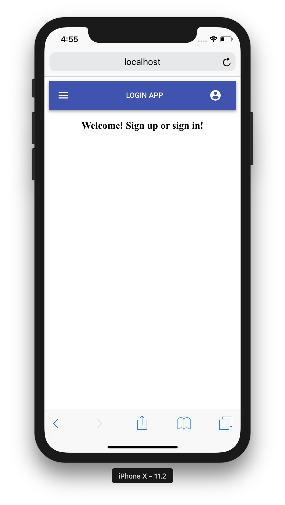

# LoginApp

Simple Login App

* Database MongoDB
* Designed with Material UI
* Authenticated with Json Web Token
* Bootstrapped with [Create React App](https://github.com/facebookincubator/create-react-app).

👀 [See the application](https://login-app-fwezmuslgb.now.sh)

## Scripts

* `npm install && npm run setup-server` para instalar las dependencias
* `npm run dev` para entorno de desarrollo
* `npm run build && npm start` para producción

## Licencia

MIT